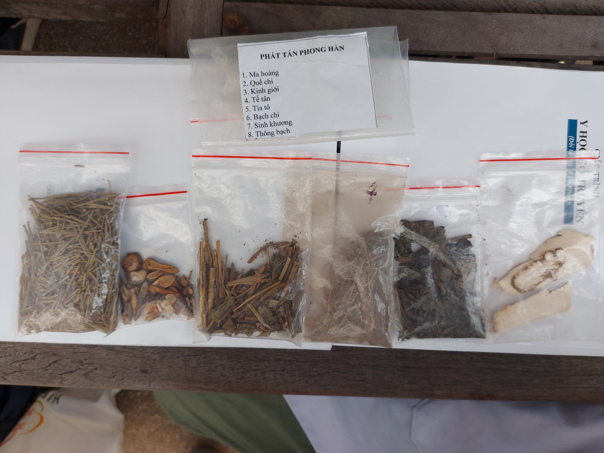
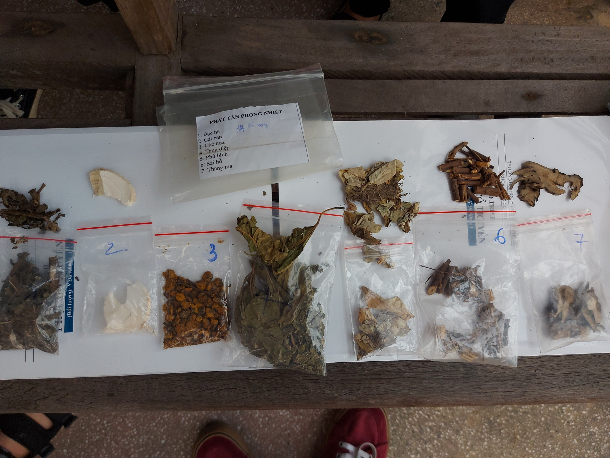
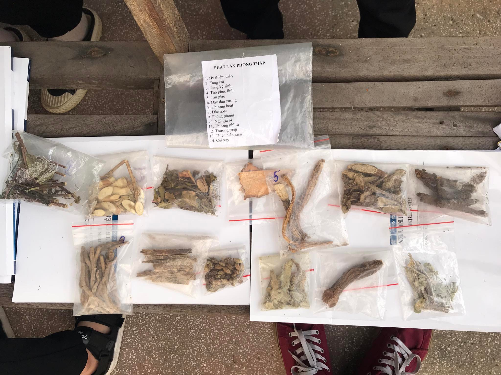
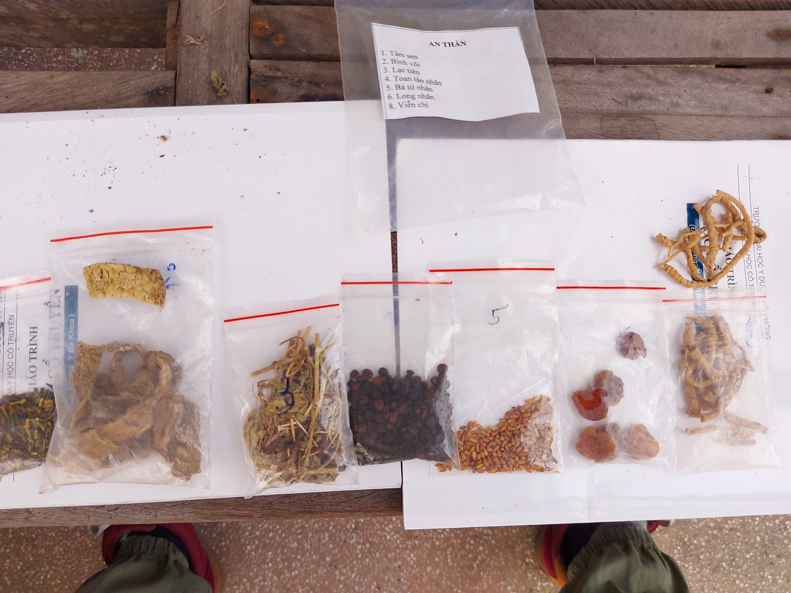
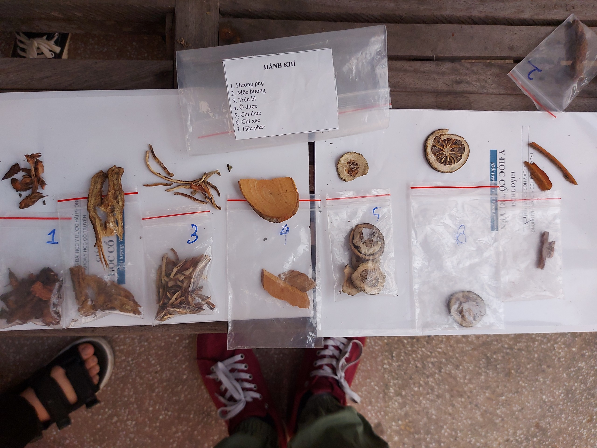
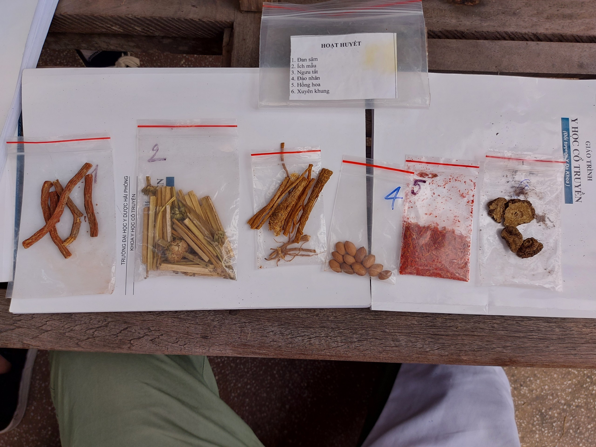
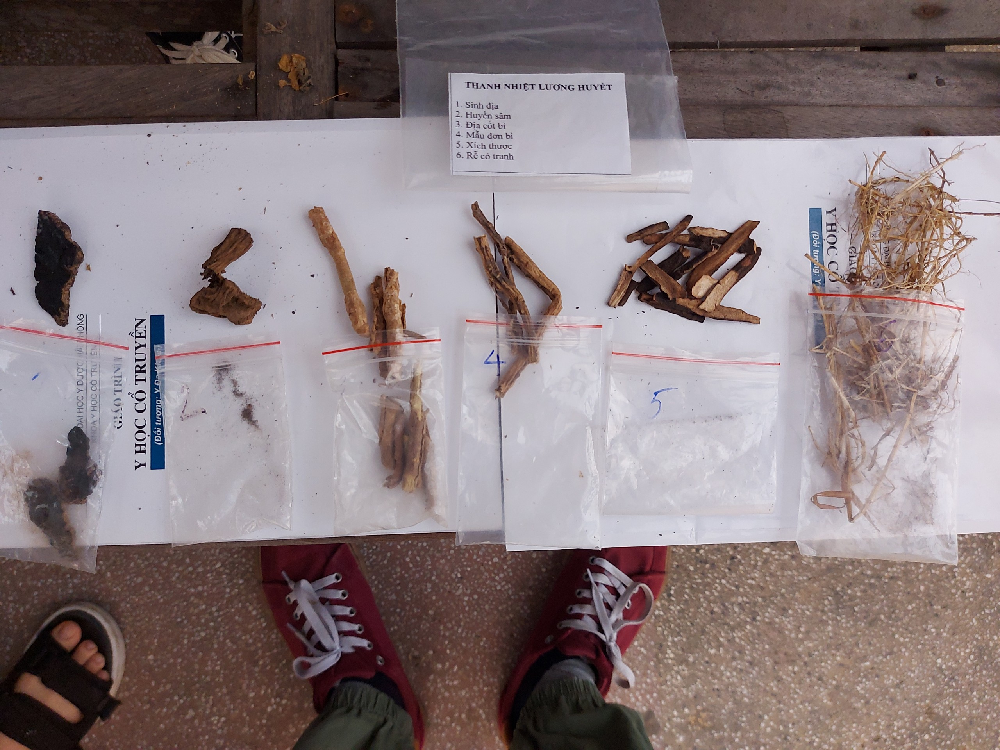

# Bản tóm tắm chương trình học môn Cổ Truyền (4 tuần)

| Tên thuốc | Hình ảnh |
| --------------- | ------------------------- |
|*Phát tán phong hàn*  1. Mà hoàng  2. Quế chi  3. Kinh giới  4. Tế tân  5. Tía tô  6. Bạch chỉ     ||
|*Phát tán phong nhiệt*  1. Bạc hà  2. Cát căn  3. Cúc hoa  4. Tang diệp  5. Phù bình  6. Sài hồ  7. Thăng ma ||
|*Phát tán phong thấp*  1. Hy thiêm thảo  2.Tang chi||
|*An thần*  1. Tâm sen  2. Bình vôi  3. Lạc viên  4. Toan táo nhân  5. Bá tử nhân  6. Long nhãn  7. Viễn chí |
|*Hành khí*  1. Hương phụ  2. Mộc hương  3. Trần bì  4. ô dược  5. Chỉ thực  6. Chỉ xác  7. Hậu phác||
|*Hoạt huyết*  1. đan sâm  2. ích mẫu  3. Ngưu tất  4. đào nhân  5. Hồng hoa  6. Xuyên khung||
|*Thanh nhiệt lương huyết*  1. Sinh địa  2. Huyền sâm  3. địa cốt bì  4. Mẫu đơn bì  5. Xích thược  6. Rễ cỏ tranh||
